<div align="center">
  
</div>

<br/>

<div align="center">
  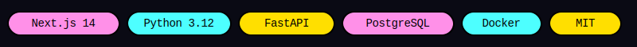
</div>

<br/>

<div align="center">
  
</div>

<div style="display: grid; grid-template-columns: 1fr 1fr 1fr; gap: 10px;">
  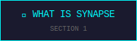
  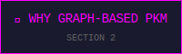
  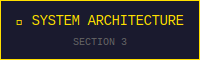
  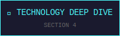
  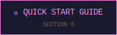
  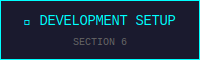
  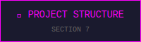
  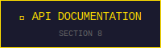
  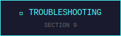
</div>

<br/>

<div style="display: grid; grid-template-columns: 1fr 1fr; gap: 10px;">
  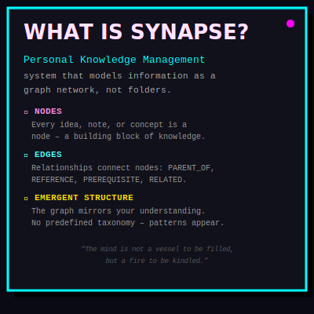
  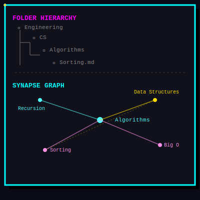
</div>

<br/>

<div align="center">
  
</div>

| Feature | Description | Technology |
|---------|-------------|------------|
| **🔍 Semantic Search** | Full-text search with relevance ranking (Title weighted higher than Content) | PostgreSQL TSVector + GIN Index |
| **🕸️ Interactive Graph** | Visualize knowledge connections; drag to create relationships | React Flow + Canvas API |
| **📺 Video Integration** | Auto-fetch YouTube metadata and thumbnails | Web Scraping (BeautifulSoup) |
| **⚡ Real-time API** | Async Python backend for concurrent request handling | FastAPI + asyncpg |
| **🐳 One-Command Deploy** | Complete containerized stack | Docker Compose |

<br/>

<div align="center">
  
</div>

<!-- Keep the plain text for the graph explanation, no huge SVG needed here -->
> **Synapse** treats every piece of knowledge as a **Node** that can connect to any other node through **Edges**. This mirrors how human cognition works — through associative connections.

<br/>

<div align="center">
  
</div>

<br/>

<div style="display: grid; grid-template-columns: 1fr 1fr; gap: 10px;">
  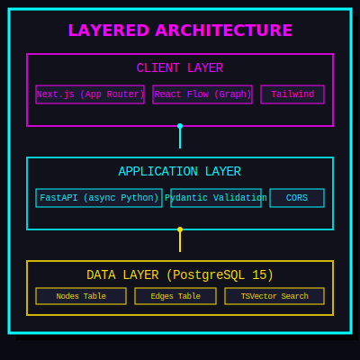
  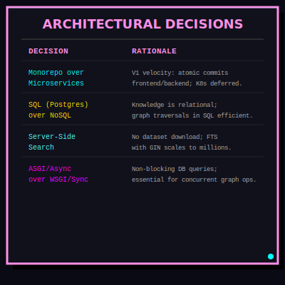
</div>

<div align="center">
  
</div>

<div style="display: grid; grid-template-columns: 1fr 1fr; gap: 10px;">
  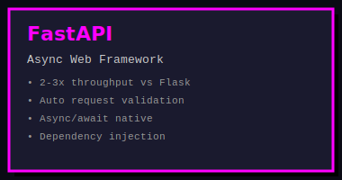
  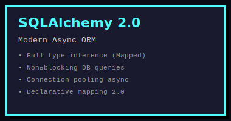
  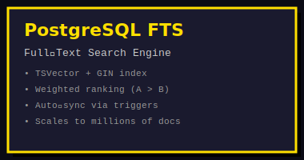
  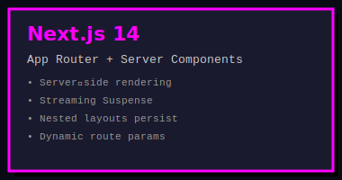
  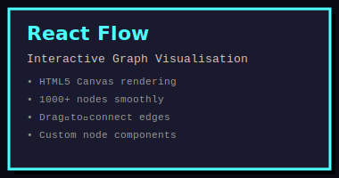
  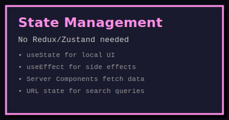
</div>

<br/>

<div align="center">
  
</div>

### Prerequisites
- **Docker Desktop** 4.25+
- **Git** 2.40+
- **4GB RAM** minimum (8GB recommended)

### Step-by-Step Setup

**1. Clone the Repository**
```bash
git clone https://github.com/arjun1k-dev/synapse-pkm.git
cd synapse-pkm
```

**2. Configure Environment Variables**
```bash
cp .env.example .env
```
Edit `.env` with your database credentials.

**3. Launch the Application Stack**
```bash
docker-compose up --build
```
*Backend at `http://localhost:8000`, Frontend at `http://localhost:3000`*

**4. Initialize the Database Schema**
```bash
docker-compose exec backend python -m backend.init_db
```

<br/>

<div align="center">
  
</div>

```bash
# Backend
cd backend
python3.12 -m venv venv
source venv/bin/activate
pip install -r requirements.txt
uvicorn backend.main:app --reload --port 8000

# Frontend
cd frontend
pnpm install
pnpm dev
```

<br/>

<div align="center">
  
</div>

<br/>

<div align="center">
  
</div>

#### Nodes

| Method | Endpoint | Description | Request Body | Response |
|--------|----------|-------------|--------------|----------|
| `GET` | `/nodes/?q={query}` | Search nodes | — | `NodeResponse[]` |
| `GET` | `/nodes/{id}` | Get specific node | — | `NodeResponse` |
| `POST` | `/nodes/` | Create new node | `NodeCreate` | `NodeResponse` |
| `PUT` | `/nodes/{id}` | Update node | `NodeCreate` | `NodeResponse` |
| `DELETE` | `/nodes/{id}` | Delete node | — | `{"message": "Deleted"}` |

#### Edges

| Method | Endpoint | Description | Request Body | Response |
|--------|----------|-------------|--------------|----------|
| `GET` | `/edges/` | List all edges | — | `EdgeResponse[]` |
| `POST` | `/edges/` | Create connection | `EdgeCreate` | `EdgeResponse` |
| `GET` | `/nodes/{id}/connections` | Get edges from node | — | `EdgeResponse[]` |

<br/>

<div align="center">
  
</div>

*All troubleshooting steps remain as text, e.g.:*

**Port Already in Use**
```bash
sudo systemctl stop postgresql
```

**Backend: `Connection refused`** – verify `DATABASE_URL` uses `db` as hostname inside Docker.

<br/>

<div align="center">
  
</div>


<br/>

<div align="center">
  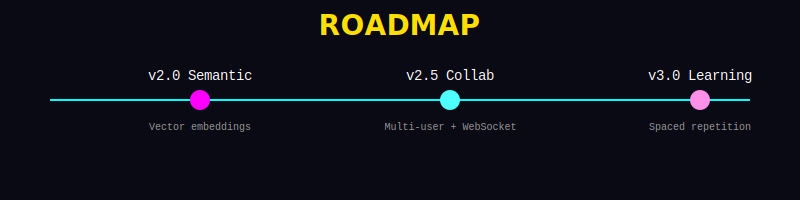
</div>

<br/>

<div align="center">
  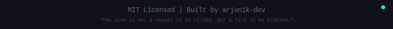
</div>

---

**Built with ❤️ by [arjun1k-dev](https://github.com/arjun1k-dev)**

> *"The mind is not a vessel to be filled, but a fire to be kindled — and fires spread through connections."*
